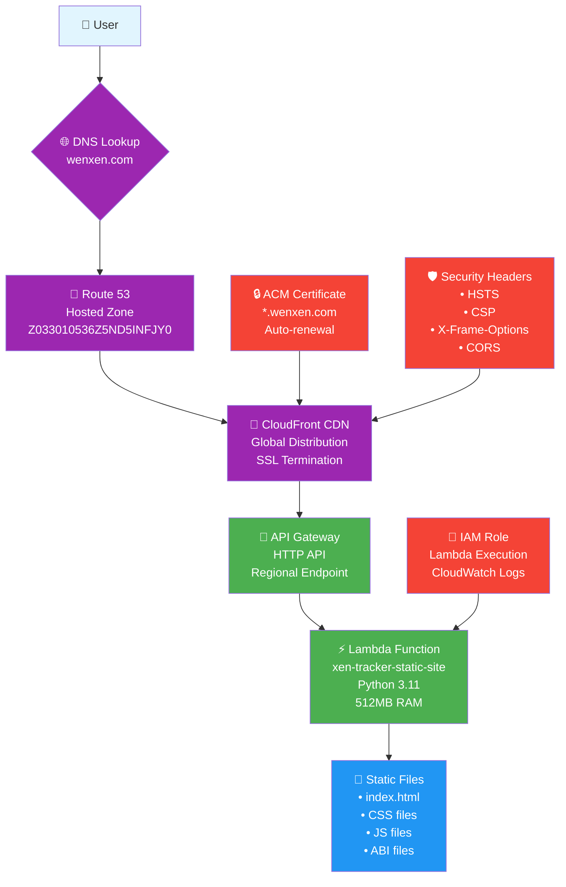

# XEN Tracker AWS Architecture

## Architecture Overview

### 🌍 **Global Edge Network**
- **CloudFront**: 200+ edge locations worldwide
- **Custom Domain**: wenxen.com + www.wenxen.com
- **SSL/TLS**: Automatic HTTPS with AWS Certificate Manager

### ⚡ **Serverless Compute**
- **Lambda Function**: Pay-per-request execution
- **API Gateway**: HTTP API for Lambda integration
- **Auto-scaling**: Handles 1000+ concurrent requests

### 📁 **Static File Serving**
- **Embedded Files**: All website files packed in Lambda deployment
- **File Types**: HTML, CSS, JavaScript, ABI contracts
- **Content Types**: Proper MIME type handling

### 🛡️ **Security Features**
- **SSL Certificate**: Auto-validated via Route 53
- **Security Headers**: HSTS, CSP, X-Frame-Options
- **CORS**: Configured for web3 wallet interactions
- **IAM**: Least-privilege Lambda execution role

### 💰 **Cost Optimization**
- **Pay-per-use**: Only charged when someone visits
- **Free Tier**: 1M Lambda requests/month free
- **Estimated Cost**: ~$1-3/month for 10k visits

## Request Flow

1. **User visits wenxen.com**
2. **Route 53** resolves domain to CloudFront
3. **CloudFront** checks cache, forwards to API Gateway if needed
4. **API Gateway** invokes Lambda function
5. **Lambda** serves static files with proper headers
6. **Response** cached at CloudFront edge locations globally

## Deployment Resources

### Created by Terraform:
- ✅ Lambda Function (`xen-tracker-static-site`)
- ✅ API Gateway HTTP API
- ✅ CloudFront Distribution
- ✅ ACM SSL Certificate
- ✅ Route 53 A Records (apex + www)
- ✅ Certificate validation records
- ✅ IAM Role and Policies
- ✅ Security Headers Policy
- ✅ CORS Configuration

### Key Benefits:
- 🚀 **Global Performance**: CloudFront CDN
- 💸 **Cost Effective**: Serverless pay-per-use
- 🔒 **Secure**: HTTPS, security headers
- 🔄 **Auto-scaling**: Handles traffic spikes
- 🛠️ **Easy Updates**: Single command deployment