# XEN Tracker AWS Cost Analysis

## Detailed Cost Analysis

### 📊 **Monthly Costs for Different Usage Levels**

| Service | 1k visits | 10k visits | 100k visits |
|---------|-----------|------------|-------------|
| **Lambda Requests** | $0.00* | $0.50 | $5.00 |
| **Lambda Compute** | $0.00* | $0.30 | $3.00 |
| **API Gateway** | $0.00* | $0.70 | $7.00 |
| **CloudFront** | $0.00* | $0.40 | $4.00 |
| **Route 53** | $0.50 | $0.50 | $0.50 |
| **ACM Certificate** | $0.00 | $0.00 | $0.00 |
| **Total** | **$0.50** | **$2.40** | **$19.50** |

*\* Covered by AWS Free Tier*

### 🆓 **AWS Free Tier Benefits**

```mermaid
graph TB
    FT[🎁 AWS Free Tier] --> Lambda[⚡ Lambda<br/>1M requests/month<br/>400k GB-seconds]
    FT --> CF[🚀 CloudFront<br/>50GB data transfer<br/>2M HTTP requests]
    FT --> API[🌉 API Gateway<br/>1M requests/month]
    FT --> R53[📍 Route 53<br/>1M DNS queries/month]
    
    classDef free fill:#4caf50,color:#fff
    class FT,Lambda,CF,API,R53 free
```

### 💰 **Cost Comparison vs Traditional Hosting**

| Hosting Type | Setup Cost | Monthly Cost | Scaling | Maintenance |
|--------------|------------|--------------|---------|-------------|
| **AWS Lambda** | $0 | $0.50-$2.40 | Automatic | None |
| **VPS (DigitalOcean)** | $0 | $5-$20 | Manual | High |
| **Shared Hosting** | $0 | $3-$10 | Limited | Medium |
| **Dedicated Server** | $0 | $50+ | Manual | Very High |

### 📈 **Cost Scaling Pattern**

## Cost Optimization Features

### 🔄 **Built-in Optimizations**
- **Lambda Cold Start**: Minimal impact with proper sizing
- **CloudFront Caching**: Reduces Lambda invocations by ~80%
- **Gzip Compression**: Reduces data transfer costs
- **Regional Edge Caches**: Further reduces origin requests

### 📊 **Real-World Cost Examples**

**Personal Portfolio (500 visits/month)**
- Total: ~$0.50/month (mostly Route 53)

**Small Business Site (5k visits/month)**
- Total: ~$1.20/month 

**Popular DApp (50k visits/month)**
- Total: ~$12/month

**Viral Launch (500k visits/month)**
- Total: ~$85/month (but handles the traffic!)

### 💡 **Cost Control Strategies**

1. **CloudWatch Monitoring**: Track usage patterns
2. **Budget Alerts**: Set spending limits
3. **Reserved Capacity**: Not applicable for serverless
4. **Resource Tagging**: Track costs per environment

### 🎯 **ROI Benefits**

- **Zero Infrastructure Management**
- **Automatic Scaling** (no over-provisioning)
- **Global Performance** (built-in CDN)
- **High Availability** (99.9% uptime SLA)
- **Security Included** (SSL, DDoS protection)

Your XEN Tracker gets enterprise-grade infrastructure at startup costs!