# XEN Tracker Deployment Flow

```mermaid
sequenceDiagram
    participant Dev as 👨‍💻 Developer
    participant TF as 🏗️ Terraform
    participant AWS as ☁️ AWS
    participant R53 as 📍 Route 53
    participant ACM as 🔒 ACM
    participant CF as 🚀 CloudFront
    participant API as 🌉 API Gateway
    participant Lambda as ⚡ Lambda
    participant User as 👤 User

    Note over Dev,AWS: Deployment Phase
    Dev->>TF: terraform apply
    TF->>AWS: Create IAM Role
    TF->>Lambda: Package & Deploy Function
    Note right of Lambda: Contains all static files:<br/>HTML, CSS, JS, ABI
    
    TF->>API: Create HTTP API
    TF->>API: Configure Lambda integration
    
    TF->>ACM: Request SSL Certificate
    ACM->>R53: Create validation records
    Note right of R53: DNS validation for<br/>wenxen.com & www.wenxen.com
    ACM->>ACM: Certificate issued ✅
    
    TF->>CF: Create Distribution
    TF->>CF: Configure custom domain
    TF->>CF: Apply SSL certificate
    TF->>CF: Set security headers
    
    TF->>R53: Create A records
    Note right of R53: wenxen.com → CloudFront<br/>www.wenxen.com → CloudFront
    
    TF->>Dev: ✅ Deployment Complete!
    
    Note over Dev,User: Runtime Phase
    User->>R53: DNS lookup wenxen.com
    R53->>User: CloudFront IP
    
    User->>CF: HTTPS request
    Note right of CF: Cache check
    CF->>API: Forward to origin
    API->>Lambda: Invoke function
    
    Note right of Lambda: Serve static files<br/>with proper MIME types
    Lambda->>API: HTML/CSS/JS response
    API->>CF: Response with headers
    CF->>User: Cached response
    
    Note over User: XEN Tracker loads ⚡
```

## Deployment Timeline

### Phase 1: Infrastructure Setup (2-3 minutes)

### Phase 2: SSL Certificate Validation (3-5 minutes)
- Certificate request to ACM
- DNS validation records created
- Domain ownership verification
- Certificate issued and deployed

### Phase 3: CloudFront Deployment (2-3 minutes)
- Distribution configuration
- SSL certificate attachment
- Security headers setup
- Origin configuration

### Phase 4: DNS Configuration (1 minute)
- A records for apex domain
- A records for www subdomain
- Alias to CloudFront distribution

## Post-Deployment

### Immediate Access (< 1 minute)
- API Gateway URL works immediately
- Direct Lambda invocation ready

### Domain Access (5-15 minutes)
- DNS propagation worldwide
- SSL certificate active
- CloudFront fully deployed

### Verification Steps
1. ✅ Check `https://wenxen.com`
2. ✅ Check `https://www.wenxen.com` 
3. ✅ Verify SSL certificate
4. ✅ Test XEN Tracker functionality