# WenXen.com - Complete System Flow Diagrams

## High-Level Application Architecture

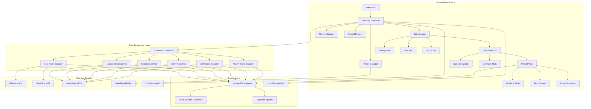

## Application Initialization Flow

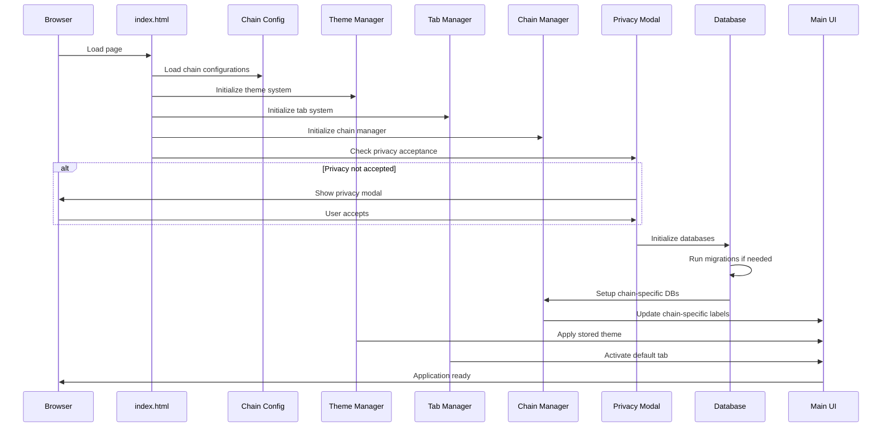

## Multi-Chain Configuration System

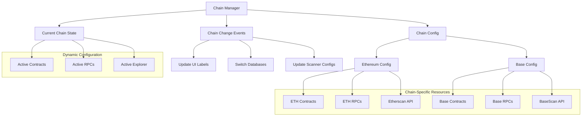

## Scanning System Architecture

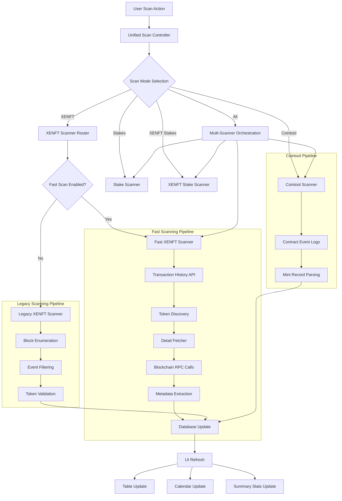

## Fast XENFT Scanning Detail Flow

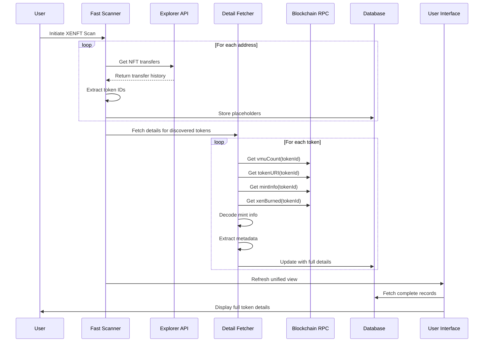

## Database Architecture & Migration System

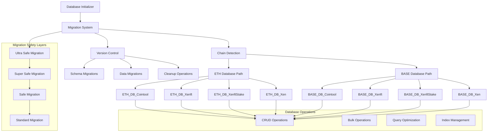

## UI Component Interaction Flow

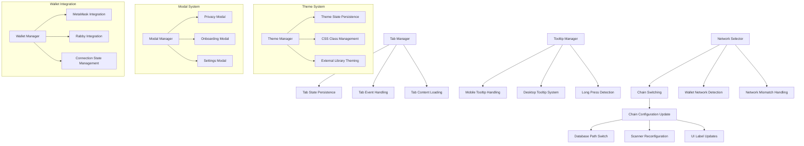

## Data Flow Through Unified View

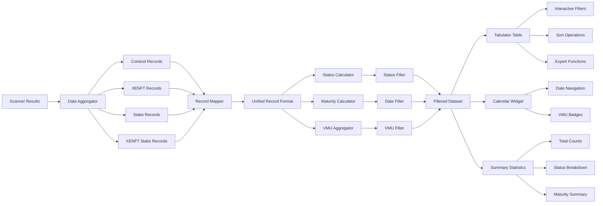

## Wallet Integration & Blockchain Interaction

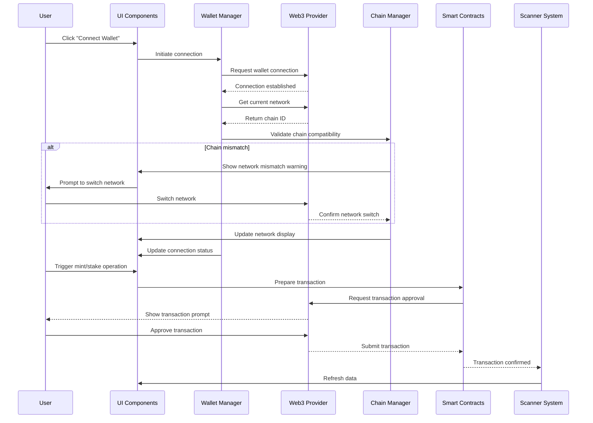

## Export & Data Management Flow

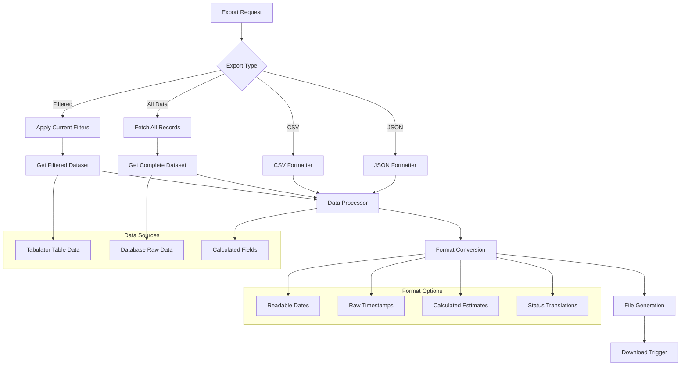

## Error Handling & Recovery System

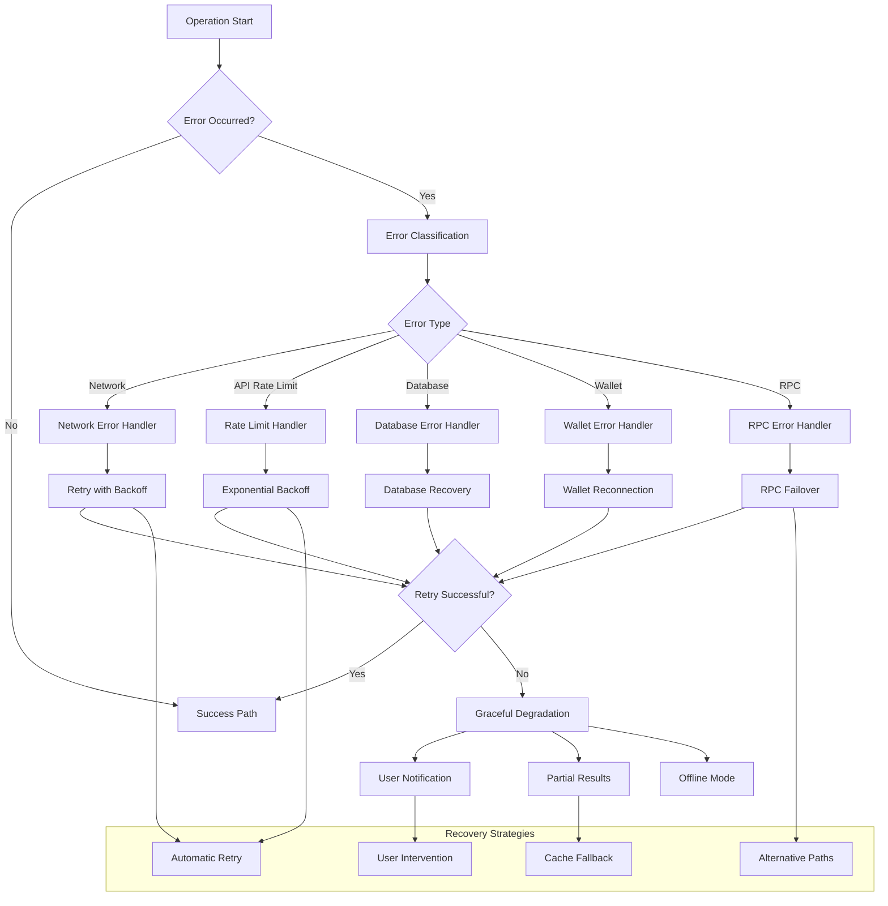

## Progress Reporting & User Feedback

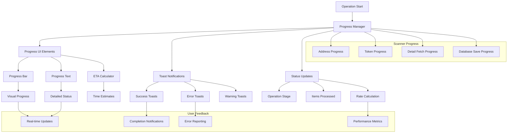

## Configuration & Settings Management

```mermaid
graph TB
    A[Settings Manager] --> B[Storage Layer]
    B --> C[LocalStorage]
    B --> D[IndexedDB Config]
    B --> E[Session Storage]
    
    A --> F[Configuration Categories]
    F --> G[Chain Settings]
    F --> H[User Preferences]
    F --> I[API Configuration]
    F --> J[Display Options]
    
    G --> K[Active Chain]
    G --> L[Custom RPCs]
    G --> M[Contract Addresses]
    
    H --> N[Theme Selection]
    H --> O[Tab Preferences]
    H --> P[Privacy Settings]
    
    I --> Q[API Keys]
    I --> R[Rate Limits]
    I --> S[Timeout Settings]
    
    J --> T[Table Columns]
    J --> U[Date Formats]
    J --> V[Number Formats]
    
    subgraph "Settings Persistence"
        W[Auto-save on Change]
        X[Validation on Load]
        Y[Migration on Update]
        Z[Backup on Export]
    end
    
    A --> W
    A --> X
    A --> Y
    A --> Z
    
    subgraph "Settings UI"
        AA[Settings Tab]
        BB[Modal Dialogs]
        CC[Inline Editors]
        DD[Quick Toggles]
    end
    
    F --> AA
    A --> BB
    A --> CC
    A --> DD
```

## Analytics & Performance Monitoring

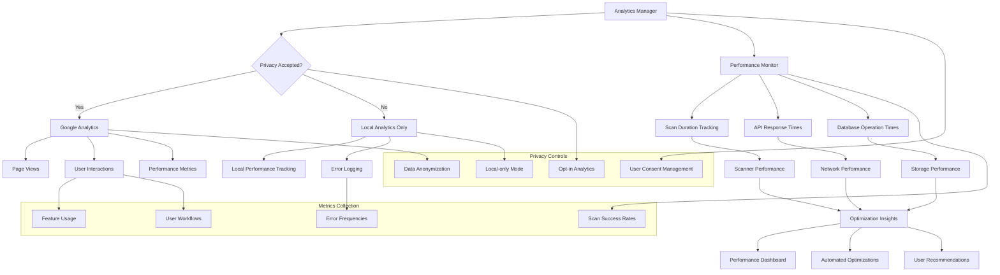

This comprehensive flow diagram captures all major interactions, data flows, and system components in the WenXen.com application, from initialization through complex scanning operations to user interaction and error handling.